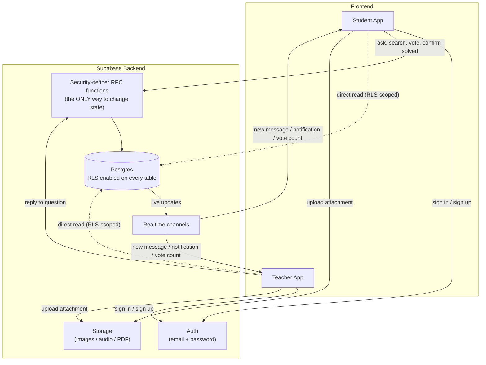
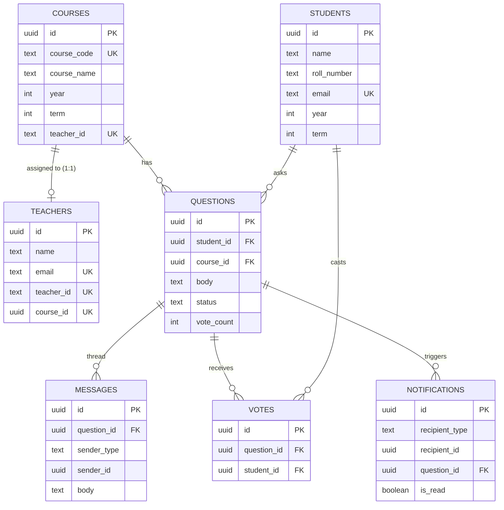
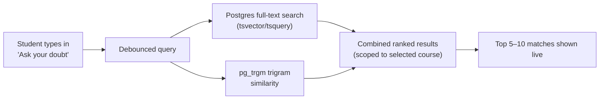

#Forkathon 2026: [AskFlow] by [KUET_Galacticos]

 **Built for ForkedArch Freshers Hackathon 2026**
 
**👥 Team :**

| Name                     | Roll      | Department | GitHub            |
| ------------------------ | --------- | ---------- | ----------------- |
| Md. Arman Shahriar Rupom | 2K2507001 | CSE        | @Rupom2007        |
| Abhijit Adhikary         | 2K2507003 | CSE        | @abhijit-adhikary |
| Maliha Fairoz            | 2K2507089 | CSE        | @malihafairoz14   |
| Mishuk Kumar Sarker      | 2K2507018 | CSE        | @mishukdevs       |

---

## ❔ Problem
### Problem Statement :
> The Silent Classroom

The teacher asks a question.
Silence.

Not because nobody understands it—but because half the room is afraid to raise their hand. Some students don't want to look confused. Some don't want to interrupt. Others have questions that are completely different from what everyone else is thinking.

After class, suddenly everyone has questions.

And you discover that many people were confused about the exact same thing.

Maybe create a simple system that helps students ask questions and share doubts in a classroom or learning environment.

Post a question.
Browse questions from others.
Search for similar questions.
Upvote questions they also want answered.
Mark questions as answered or unresolved.

You could allow questions to be associated with a course, topic, chapter or class.

Think about how can you help students who are too shy to ask a question publicly—and how can you prevent the same question from being asked again and again?

A basic version only needs question posting, categories, search/filtering, and voting. More advanced teams could experiment with anonymous questions, teacher responses, tags, duplicate detection, or reputation systems.

### 🤔 [KUET_Galácticos]'s Understanding :
**The Main Issue:**

Students stay quiet during class because they are nervous to speak up in front of others. Teachers think the class understands the lesson when it is actually just quiet. After class, students realize that many of them had the exact same question.  
**Experience:**

As I (Rupom) am a student of CSE department. I am very introvert. We have some theoretical courses like Physics, Discrete Math, Structure Programming. Sometimes I don't understand what the teacher is teaching us but I can't ask anything to the teacher because of my shyness. For this I need to work hard later to understand the problem.
**Our Main Goal:**

Create a clean, simple tool for classes where any student can post a doubt without feeling judged, vote on other students' questions and save their valuable time.
**Basic Features:**

1. **Ask a Question:** 
Let students write and submit their doubts.
2. **Organize by Topic:** 
Group questions by class, subject, chapter, or topic.
3. **Browse and Search:** 
Help students quickly find past questions before posting a new one.
4. **Upvote System:**
Let students click "upvote" on a question if they also want to know the answer.
5. **Status Tag:** 
Show whether a question is answered or still open.

**Extra Features for Better Experience:**
1. **Anonymous Posting:** 
Allow students to hide their names so they feel completely safe asking anything.
2. **Duplicate Warning:** 
Warn users if a similar question has already been posted.
3. **Teacher Answers:** 
Give teachers an easy way to reply directly and highlight the best answers.

---
## 💡 Our Solution
### Overview
We will make a QnA environment where students can ask questions to their teachers anonymously.
### How It Works
Explain the complete flow of your system.
1.
2.
3.
---
## 🏗️ Architecture :

# 🏛️ AskFlow — Architecture

This document explains how AskFlow is put together: system layers, data model, the status state machine, and the two integrity rules the whole product depends on (anonymity, and "teachers can't self-grade their own answers").

---

## 1. System Overview

**The one rule that matters most:** clients can *read* the database directly (scoped down by RLS), but they can never *write* to `questions.status` directly. Every state change — posting a reply, confirming "solved," casting a vote — goes through a `security definer` RPC function that checks who's calling before it touches anything[cite: 3]. 

---

## 2. Data Model

**Why `course_code` (not name) is the unique key:** the catalog has multiple courses literally named "Machine Learning" in different years/terms (CSE4109, CSE4111, CSE4211). They are deliberately kept as separate rows — merging by name would silently collapse three different courses, with three different teachers, into one.

---

## 3. Search & Duplicate Detection

No external API call, no network latency, no key to manage — chosen specifically so a live demo can't stall on a third-party service. 

---

## 4. Security Model (Two Enforcement Layers)

1. **Row Level Security (every table):**
   * A student can only ever `SELECT` questions in their own year/term's courses; a teacher only their one assigned course.
   * No table policy ever returns a student's name/roll/email to a peer or to the teacher's list view.
   * `UPDATE` on `questions.status` is blocked entirely at the RLS layer for ordinary client writes.
2. **RPC functions (`security definer`):** the only path that can change state[cite: 3]. Each function re-checks the caller's identity server-side before acting:
   * `post_teacher_reply` — only the course's assigned teacher; flips status to `answered`.
   * `mark_question_solved` — only the asking student.
   * `get_question_thread` — the *only* place a student's real name is ever returned, and only to the assigned teacher.

---

## 5. Realtime Channels

| Channel | Filtered by | Drives |
|---|---|---|
| `messages` | `question_id` | Live chat thread updates |
| `notifications` | `recipient_id` | Notification bell badge |
| `questions` | `course_id` | Live vote-count/status re-sorting on both dashboards |

---

## 6. Out of Scope (MVP)

* Speech-to-text on voice messages (audio is stored and played back, not transcribed)
* One teacher assigned to more than one course
* Admin/moderation role
* Cross-course search
* Semantic (embedding-based) search — stretch goal only
Arena</b>
