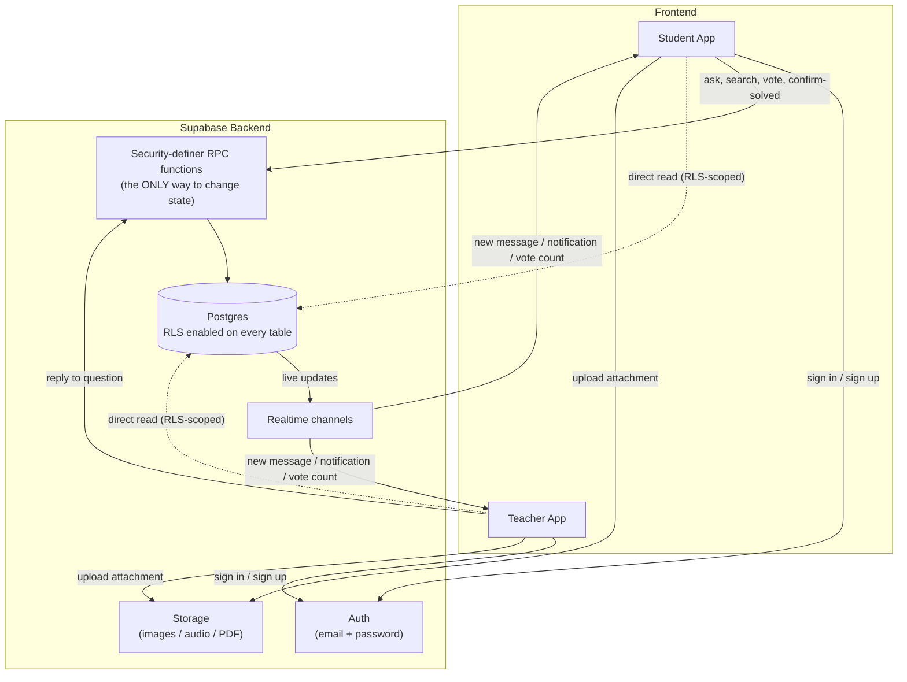
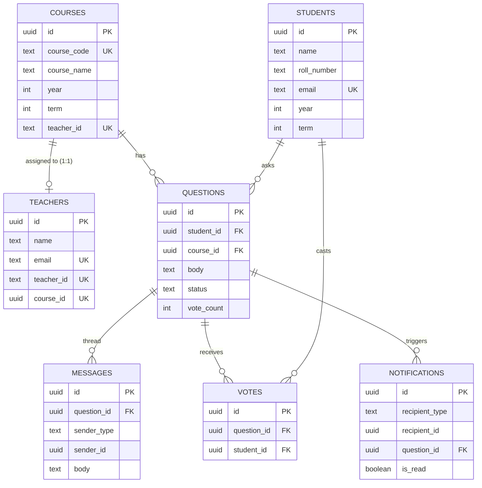
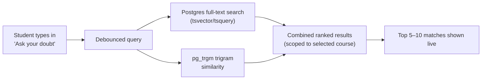

<h1><strong>Forkathon 2026: [AskFlow] by [KUET_Galácticos]</strong></h1>

**Built for ForkedArch Freshers Hackathon 2026**

 
## **👥 Team :**

| Name                     | Roll      | Department | GitHub            |
| ------------------------ | --------- | ---------- | ----------------- |
| Md. Arman Shahriar Rupom | 2K2507001 | CSE        | @Rupom2007        |
| Abhijit Adhikary         | 2K2507003 | CSE        | @abhijit-adhikary |
| Mishuk Kumar Sarker      | 2K2507018 | CSE        | @mishukdevs       |
| Maliha Fairoz            | 2K2507089 | CSE        | @malihafairoz14   |

---

## ❔ Problem
### Problem Statement :
> The Silent Classroom

The teacher asks a question.
Silence.

Not because nobody understands it—but because half the room is afraid to raise their hand. Some students don't want to look confused. Some don't want to interrupt. Others have questions that are completely different from what everyone else is thinking.

After class, suddenly everyone has questions.

And you discover that many people were confused about the exact same thing.

Maybe create a simple system that helps students ask questions and share doubts in a classroom or learning environment.

Post a question.
Browse questions from others.
Search for similar questions.
Upvote questions they also want answered.
Mark questions as answered or unresolved.

You could allow questions to be associated with a course, topic, chapter or class.

Think about how can you help students who are too shy to ask a question publicly—and how can you prevent the same question from being asked again and again?

A basic version only needs question posting, categories, search/filtering, and voting. More advanced teams could experiment with anonymous questions, teacher responses, tags, duplicate detection, or reputation systems.

### 🤔 [KUET_Galácticos]'s Understanding :
**The Main Issue:** 
Students stay quiet during class because they are nervous to speak up in front of others. Teachers think the class understands the lesson when it is actually just quiet. After class, students realize that many of them had the exact same question.  
**Experience:** 
As I (Rupom) am a student of CSE department. I am very introvert. We have some theoretical courses like Physics, Discrete Math, Structure Programming. Sometimes I don't understand what the teacher is teaching us but I can't ask anything to the teacher because of my shyness. For this I need to work hard later to understand the problem.  
**Our Main Goal:** 
Create a clean, simple tool for classes where any student can post a doubt without feeling judged, vote on other students' questions and save their valuable time.

## Key Features :

### For Students :
* **Anonymous Q&A:** Ask questions without revealing your identity to peers.
* **Smart Search:** Find existing questions instantly using fuzzy and full-text search to avoid duplicates.
* **Upvoting System:** Upvote other students' questions to push them up the teacher's priority list.
* **Rich Media Attachments:** Support for text, images, audio recordings (playback only), and PDFs.
* **Status Control:** Only the student who asked the question can mark it as officially "Solved" once satisfied.
* **Live Notifications:** Get instantly notified when a teacher replies to your doubt.

### For Teachers :
* **Course-Specific Dashboard:** A streamlined queue showing questions strictly for the teacher's assigned course.
* **Smart Filtering:** Sort questions easily by **Top Voted**, **Unsolved**, and **Solved**.
* **1-on-1 Chat Threads:** Answer student doubts in a private, messenger-style thread.
* **Contextual Identity:** View the student's real name *only* inside the private thread for personalized guidance.

### Core System & Security :
* **Role-Based Auth:** Secure sign-in for Students and Teachers (via Supabase Auth).
* **Real-Time Sync:** Live updates for chat threads, vote counts, and notifications via Supabase Realtime.
* **Rock-Solid Privacy:** Anonymity and data protection are strictly enforced at the database level using Postgres Row Level Security (RLS).
---
## 💡 Our Solution :
## Solution Overview :

AskFlow is a two-sided, anonymous Q&A platform designed specifically for university classrooms to eliminate the fear of asking "dumb" questions and to reduce repetitive queries. 
Students can post academic doubts anonymously to their peers, search past questions to avoid duplicates, and upvote existing questions. Teachers get a streamlined, prioritized feed of questions for their assigned course and reply in a dedicated, private chat thread. By hiding student identities from the public feed and giving students the final say on when a doubt is "Solved," AskFlow creates a safe and highly efficient learning environment.

### How It Works :

### For Students :
*   **Ask Anonymously:** Post questions using text, images, audio recordings, or PDFs. Your identity is completely hidden from your classmates.
*   **Smart Search & Upvote:** Before asking, use the search bar to find similar questions (powered by Postgres full-text and fuzzy search). If your doubt is already there, simply upvote it to push it to the top of the teacher's queue!
*   **Own the Solution:** When a teacher replies, your question automatically becomes **"Answered"**. Only *you* can click the green checkmark (✓) to officially mark it as **"Solved"** once you are completely satisfied with the explanation.

### For Teachers :
*   **Focused Dashboard:** Teachers are assigned 1:1 to their specific course and see a dedicated queue of student questions.
*   **Prioritized Feed:** Easily filter the feed by **Top Voted**, **Unsolved**, and **Solved** to address the most pressing issues first.
*   **1-on-1 Chat Threads:** Reply to questions in a direct, messenger-style thread. Inside the private thread, the teacher can see the asking student's real name to provide personalized guidance.

### Under the Hood :
*   **Tech Stack:** Built on Google Antigravity and Supabase (Postgres, Auth, Storage).
*   **Real-time Updates:** Chat threads, notifications, and vote counts update instantly using Supabase Realtime.
*   **Strict Privacy:** Student anonymity isn't just hidden in the UI; it is strictly enforced at the database layer using Postgres Row Level Security (RLS).
*   **Status Lifecycle:** State changes (Unsolved → Answered → Solved) are handled securely via backend database functions.

## 🏗️ Architecture :

# 🏛️ AskFlow — Architecture :

This document explains how AskFlow is put together: system layers, data model, the status state machine, and the two integrity rules the whole product depends on (anonymity, and "teachers can't self-grade their own answers").

---

## 1. System Overview :

**The one rule that matters most:** clients can *read* the database directly (scoped down by RLS), but they can never *write* to `questions.status` directly. Every state change — posting a reply, confirming "solved," casting a vote — goes through a `security definer` RPC function that checks who's calling before it touches anything. 

---

## 2. Data Model :

**Why `course_code` (not name) is the unique key:** the catalog has multiple courses literally named "Machine Learning" in different years/terms (CSE4109, CSE4111, CSE4211). They are deliberately kept as separate rows — merging by name would silently collapse three different courses, with three different teachers, into one.

---

## 3. Search & Duplicate Detection :

No external API call, no network latency, no key to manage — chosen specifically so a live demo can't stall on a third-party service. 

---

## 4. Security Model (Two Enforcement Layers) :

1. **Row Level Security (every table):**
   * A student can only ever `SELECT` questions in their own year/term's courses; a teacher only their one assigned course.
   * No table policy ever returns a student's name/roll/email to a peer or to the teacher's list view.
   * `UPDATE` on `questions.status` is blocked entirely at the RLS layer for ordinary client writes.
2. **RPC functions (`security definer`):** the only path that can change state. Each function re-checks the caller's identity server-side before acting:
   * `post_teacher_reply` — only the course's assigned teacher; flips status to `answered`.
   * `mark_question_solved` — only the asking student.
   * `get_question_thread` — the *only* place a student's real name is ever returned, and only to the assigned teacher.

---

## 5. Realtime Channels :

| Channel | Filtered by | Drives |
|---|---|---|
| `messages` | `question_id` | Live chat thread updates |
| `notifications` | `recipient_id` | Notification bell badge |
| `questions` | `course_id` | Live vote-count/status re-sorting on both dashboards |

---

## 6. Out of Scope (MVP) :

* Speech-to-text on voice messages (audio is stored and played back, not transcribed)
* One teacher assigned to more than one course
* Admin/moderation role
* Cross-course search
* Semantic (embedding-based) search — stretch goal only
Arena</b>

## 📜 License :

This project is open-sourced under the [MIT License](https://opensource.org/licenses/MIT).

  <strong>Forkathon: Freshers Hackathon 2026 presented by ForkedArch powered by XtendArena</strong>

